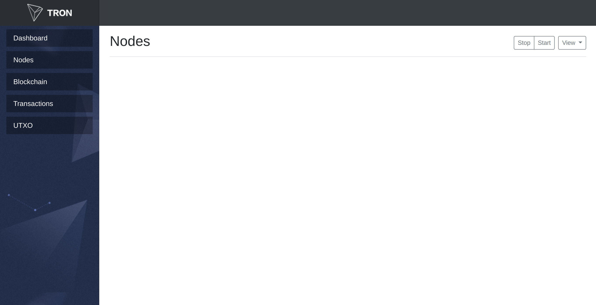

<h1 align="center">
  
   
  scala-tron-frontend
   
</h1>

<h4 align="center">
  Frontend for <a href="http://wiki.tron.network">Tron Protocol</a>
</h4>

  

  

  

  

  

  <a href="#goals">Goals</a> •
  <a href="#goals">Screenshots</a> •
  <a href="#wiki">Wiki</a> •
  <a href="CONTRIBUTING.md">Contributing</a> •
  <a href="#contact">Contact</a>

# What's TRON?

TRON is a block chain-based decentralized smart protocol and an application development platform. It allows each user to freely publish, store and own contents and data, and in the decentralized autonomous form, decides an incentive mechanism and enables application developers and content creators through digital asset distribution, circulation and transaction, thus forming a decentralized content entertainment ecosystem.

TRON is a product of Web 4.0 and the decentralized internet of next generation.

# Goals

* Web GUI for Tronix

# Screenshots

  

## Wiki

* [Introduction (Tron Protocol)](http://wiki.tron.network)

## Contact

* [Gitter](https://gitter.im/Rovak/scala-tron)
* [Telegram](https://t.me/joinchat/CP8XKBIjEc0RqzJdl61OlQ)
